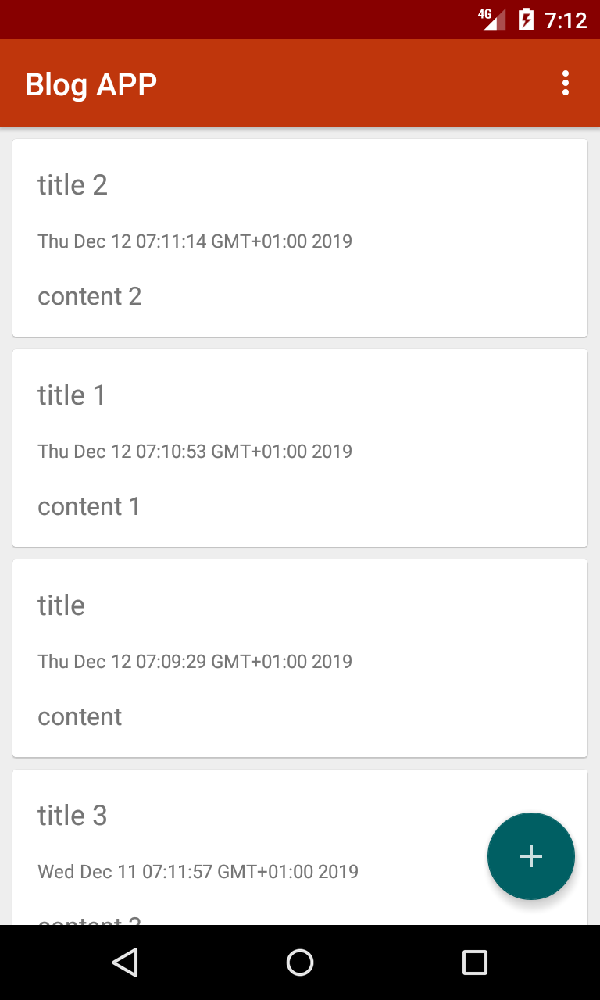
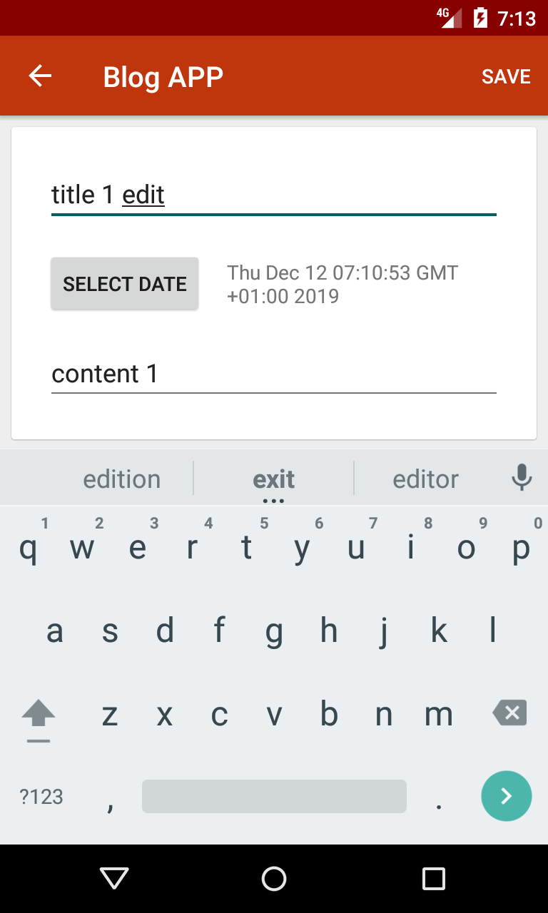

# BlogApp
In this practical, you build an app that uses the [Android Architecture Components](https://developer.android.com/topic/libraries/architecture/index.html). The app, called BlogApp, stores a list of posts in a Room database and displays the list in a RecyclerView. The BlogApp app is basic, but sufficiently complete that you can use it as a template to build on.

The BlogApp app does the following:

* Works with a database to get and save posts
* Displays all the posts in a RecyclerView in MainActivity.
* Opens a second Activity when the user taps the + FAB button. When the user enters a post, the app adds the post to the database and then the list updates automatically.
* Opens the same second Activity when user taps a post in the RecyclerView to edit it.
* On the second Activity , the user may choose a specific date for the post. If not, the post take the current date.
* Do not initializes the data in the database if there is no existing data.
* Add a menu item that allows the user to delete all the data.
* You also enable the user to swipe a post to delete it from the database.

## Application overview

  

  

 
 
**Note**: Confirmation Alerts are optionals

You must follow the diagram below for your database table


## IMPORTANT
in order to store complex data like Date in RoomDatabase you need to use converters:

```java
public class Converters {
   @TypeConverter
   public static Date fromTimestamp(Long value) {
       return value == null ? null : new Date(value);
   }

   @TypeConverter
   public static Long dateToTimestamp(Date date) {
       return date == null ? null : date.getTime();
   }
}
```
 
then add the following annotation to your RoomDatabase class under @Database :

 ```java
@Database(entities = ...)
@TypeConverters({Converters.class})
```